# Polyglot Codebase Knowledge Graph

> Generated offline by **readmenator**. Supports C, C++, Python, Go, Rust, JS/TS, Java, C#, Shell, PHP, Dart, GDScript, Nim, ASM.
> No LLMs. No tokens. Pure static analysis.

**Total Files Parsed:** 1 | **Total Symbols Extracted:** 3 | **Total Imports:** 7

## Structural Knowledge Map

```mermaid
graph TD
    classDef mod fill:#1e1e1e,stroke:#ff6666,stroke-width:2px,color:#fff;
    classDef cls fill:#2d2d2d,stroke:#4ec9b0,stroke-width:2px,color:#fff;
    classDef fn fill:#333,stroke:#dcdcaa,stroke-width:1px,color:#dcdcaa;
    classDef ext fill:#111,stroke:#666,stroke-dasharray: 5 5,color:#aaa;
    script_animator_py["script_animator.py (py)"]
    class script_animator_py mod;
    script_animator_py_add_text_to_image["add_text_to_image"]
    class script_animator_py_add_text_to_image fn;
    script_animator_py --> script_animator_py_add_text_to_image
    script_animator_py_generate_frames["generate_frames"]
    class script_animator_py_generate_frames fn;
    script_animator_py --> script_animator_py_generate_frames
    script_animator_py_main["main"]
    class script_animator_py_main fn;
    script_animator_py --> script_animator_py_main
    ext_cv2["cv2"]
    class ext_cv2 ext;
    script_animator_py -.->|imports| ext_cv2
    ext_numpy["numpy"]
    class ext_numpy ext;
    script_animator_py -.->|imports| ext_numpy
    ext_PIL["PIL"]
    class ext_PIL ext;
    script_animator_py -.->|imports| ext_PIL
    ext_time["time"]
    class ext_time ext;
    script_animator_py -.->|imports| ext_time
    ext_argparse["argparse"]
    class ext_argparse ext;
    script_animator_py -.->|imports| ext_argparse
    ext_re["re"]
    class ext_re ext;
    script_animator_py -.->|imports| ext_re
    ext_moviepy_editor["moviepy.editor"]
    class ext_moviepy_editor ext;
    script_animator_py -.->|imports| ext_moviepy_editor
```

---

## Architecture Reference

### PY (1 files)

#### `script_animator.py`
**Path:** `script_animator.py`

**Functions:**
- `add_text_to_image` (line 15)
- `generate_frames` (line 27)
- `main` (line 97)
